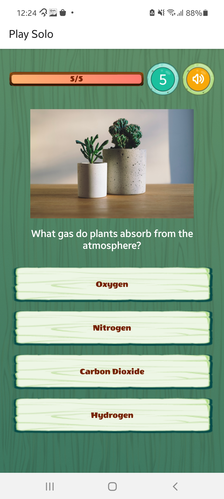
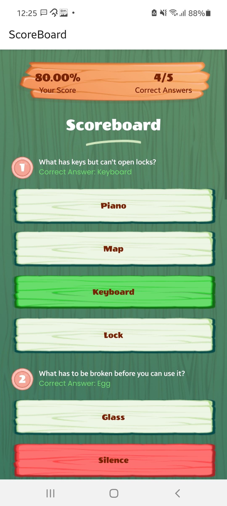

# react-native-trivia-quiz

Realtime Multiplayer Trivia Quiz Mobile app game built in React Native

Modes: 

- Single Player (with Scoreboards)
- Play with Friends Realtime (upto 50 Players or even more if you'd want to scale)
- 1x1 Random opponent 
- Public Room (Group Play with Random Opponents)

   

### Demo


**Note**: This open-source version includes only the **Single Player** mode with multiple Quiz questions, Scoreboards, Sounds etc.

### This project is built using Expo. 


#### Get started

1. Install dependencies

   ```bash
   npm install
   ```

2. Start the app
   
   - To connect your physical phone or simulator on LAN
   ```bash
    npx expo start
   ```

   - To connect your physical phone or simulator on different networks using tunnel mode
   
   ```bash
    npx expo start --tunnel
   ```

This project uses [file-based routing](https://docs.expo.dev/router/introduction) from the **app** directory.


#### Learn more about developing your project with Expo

- [Expo documentation](https://docs.expo.dev/): Learn fundamentals, or go into advanced topics with our [guides](https://docs.expo.dev/guides).
- [Learn Expo tutorial](https://docs.expo.dev/tutorial/introduction/): Follow a step-by-step tutorial where you'll create a project that runs on Android, iOS, and the web.
